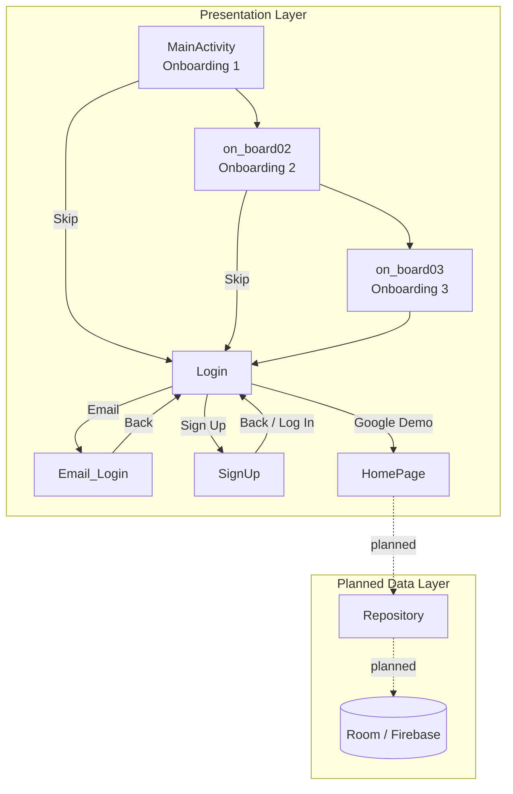

# SpendSence V2.0

> A personal finance awareness app for Android — helping users track spending, monitor savings, and build better financial habits.

**Current stage:** UI + navigation prototype &nbsp;·&nbsp; Kotlin &nbsp;·&nbsp; Min SDK 24 &nbsp;·&nbsp; Target SDK 34

---

## What's Built

| Area | Status |
|------|--------|
| Onboarding flow (3 screens) | ✅ Done |
| Login option screen (Google / Email) | ✅ Done |
| Email login form | ✅ Done |
| Sign up screen | ✅ Done |
| Home dashboard (cards + transaction list) | ✅ Done |
| Screen navigation | ✅ Done |
| Firebase / Auth backend | 🔲 Planned |
| Persistent data storage | 🔲 Planned |
| Transaction CRUD | 🔲 Planned |
| Dynamic dashboard calculations | 🔲 Planned |
| Budget logic and notifications | 🔲 Planned |

---

## Screenshots

| Onboarding 1 | Onboarding 2 | Onboarding 3 |
|---|---|---|
|  |  |  |

| Login | Sign Up | Home Dashboard |
|---|---|---|
|  |  |  |

---

## Screen Flow

```
MainActivity (Onboarding 1)
  │  ├─ [Skip] ──────────────────────────────┐
  ↓                                          │
Onboarding 2                                 │
  │  ├─ [Skip] ──────────────────────────────┤
  ↓                                          │
Onboarding 3                                 │
  │                                          ↓
  └──────────────────────────────────► Login Page
                                           │
                        ┌──────────────────┼──────────────────┐
                        ↓                  ↓                  ↓
                   Email Login          Sign Up          Google (demo)
                        │                  │                  │
                    [Back] ──────────► Login Page             │
                                                              ↓
                                                        Home Dashboard
```

> Skip buttons on each onboarding screen jump directly to Login. The Google button currently navigates to Home as a demo shortcut.

---

## Architecture



---

## Project Structure

```
app/src/main/
├── java/com/example/spendsence/
│   ├── MainActivity.kt
│   ├── on_board02.kt
│   ├── on_board03.kt
│   ├── Login.kt
│   ├── Email_Login.kt
│   ├── SignUp.kt
│   └── HomePage.kt
└── res/layout/
    ├── on_board_01.xml
    ├── on_board_02.xml
    ├── on_board_03.xml
    ├── login_page.xml
    ├── email_login.xml
    ├── signup_page.xml
    └── homepage.xml
```

---

## Tech Stack

- **Language:** Kotlin
- **UI:** XML layouts with AppCompat + Material Components
- **Build:** Gradle (Kotlin DSL)
- **Min SDK:** 24 · **Target SDK:** 34 · **Compile SDK:** 34

**Core dependencies**
- AndroidX Core KTX
- AndroidX AppCompat
- Material Components
- AndroidX Activity
- ConstraintLayout

---

## Getting Started

**Prerequisites**
- Android Studio (latest stable)
- Android SDK 34
- JDK 17

**Steps**

1. Clone the repository:
   ```bash
   git clone https://github.com/SupunLiyanage88/SpendSence_V2.0.git
   ```
2. Open the project in Android Studio.
3. Wait for Gradle sync to complete.
4. Run on an emulator or physical Android device (API 24+).

---

## Roadmap

- [ ] **v2.1** — Firebase Authentication (email + Google Sign-In)
- [ ] **v2.2** — Room database + repository pattern for local storage
- [ ] **v2.3** — Transaction add / edit / delete flows
- [ ] **v2.4** — Dynamic dashboard cards driven by real data
- [ ] **v2.5** — Budget tracking, category analytics, and spending insights
- [ ] **v3.0** — Notifications, unit tests, and instrumentation tests

---

## License

No license is currently defined for this project.
