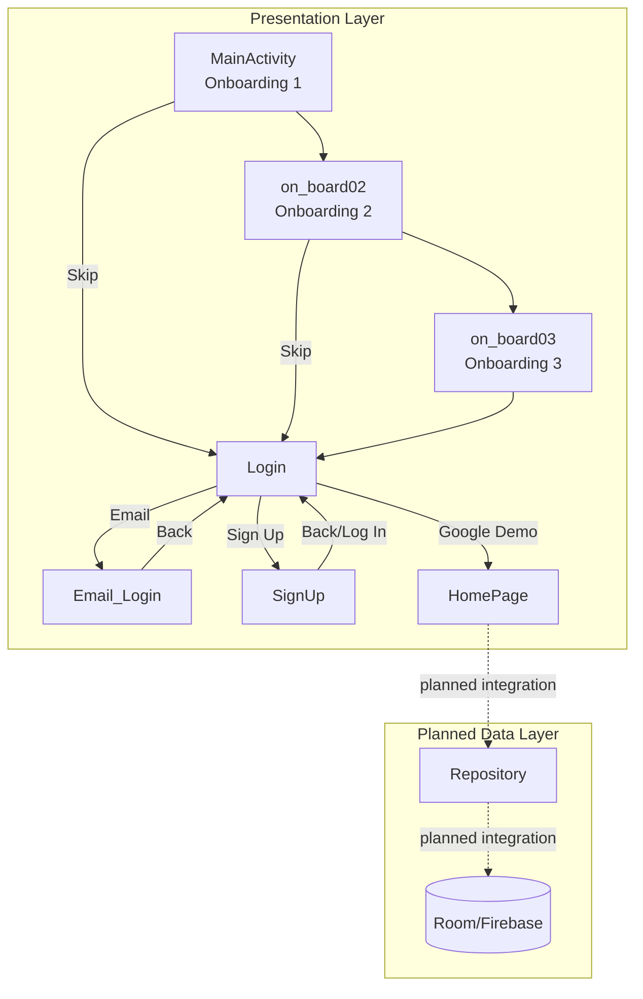
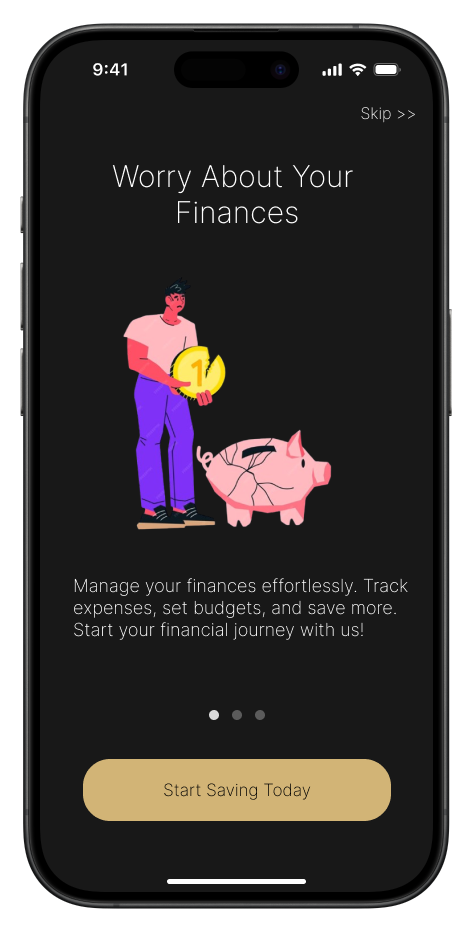
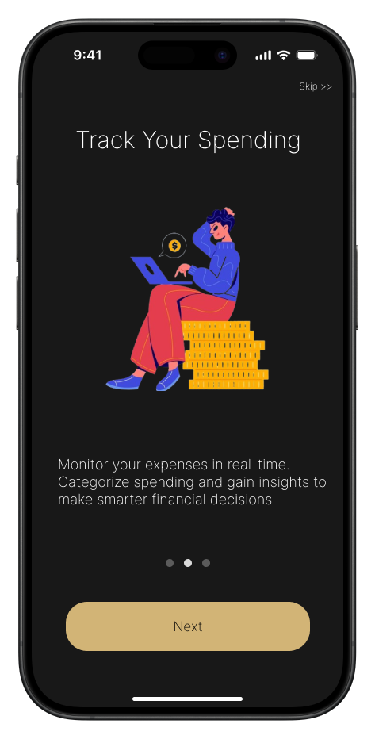
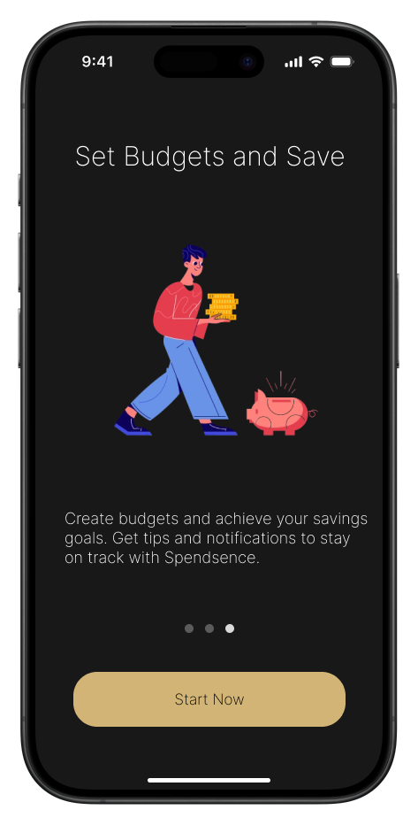
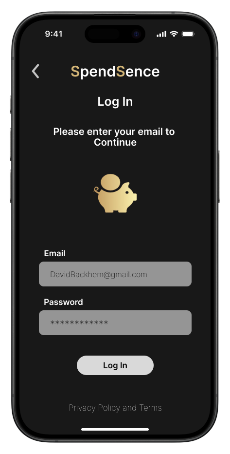
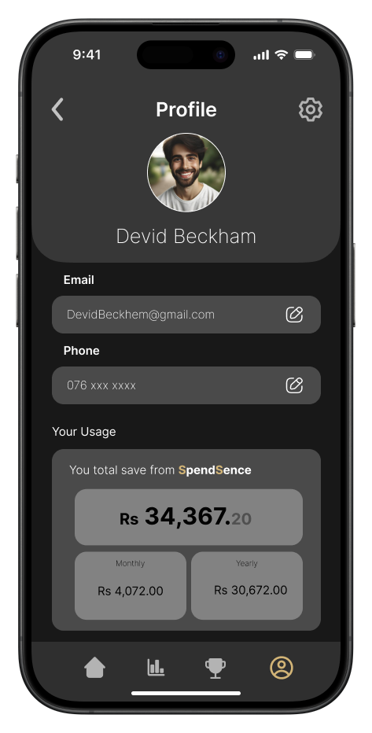
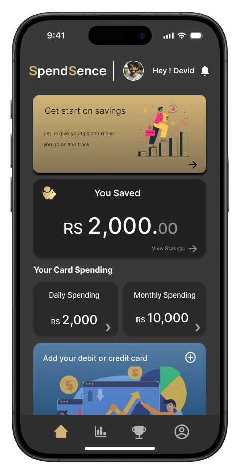

# SpendSence V2.0

SpendSence is an Android app prototype focused on personal finance awareness.  
The current version provides a polished onboarding and authentication-style flow with a dashboard UI concept for savings and spending insights.

## Current App Status

This project is currently in **UI + navigation prototype stage**.

Implemented:
- Onboarding flow (3 screens)
- Login option screen (Apple/Google/Email buttons)
- Email login form screen (UI)
- Sign up screen (UI)
- Home dashboard screen (UI cards and transaction-style list)
- Basic navigation between screens

Not implemented yet:
- Real authentication (Firebase/Auth backend)
- Persistent data storage (Room/Firebase/SQLite)
- Transaction CRUD operations
- Dynamic dashboard calculations
- Budget logic and notifications

## Screen Flow

1. `MainActivity` (`on_board_01.xml`)
2. `on_board02` (`on_board_02.xml`)
3. `on_board03` (`on_board_03.xml`)
4. `Login` (`login_page.xml`)
5. `Email_Login` (`email_login.xml`) or `SignUp` (`signup_page.xml`)
6. `HomePage` (`homepage.xml`)

Notes:
- Skip buttons in onboarding navigate directly to login.
- Email button from login opens email login UI.
- Google button in login currently navigates to home (demo behavior).

## Architecture Diagram



## Screenshots

| Screen | Preview |
|---|---|
| Onboarding 1 |  |
| Onboarding 2 |  |
| Onboarding 3 |  |
| Login |  |
| User Profile |  |
| Sign Up |  |
| Home Dashboard |  |

## Tech Stack

- Language: Kotlin
- Build system: Gradle (Kotlin DSL)
- Min SDK: 24
- Target SDK: 34
- Compile SDK: 34
- UI: XML layouts + AppCompat/Material components

Core libraries:
- AndroidX Core KTX
- AndroidX AppCompat
- Material Components
- AndroidX Activity
- ConstraintLayout

## Project Structure

```text
app/src/main/java/com/example/spendsence/
	MainActivity.kt
	on_board02.kt
	on_board03.kt
	Login.kt
	Email_Login.kt
	SignUp.kt
	HomePage.kt

app/src/main/res/layout/
	on_board_01.xml
	on_board_02.xml
	on_board_03.xml
	login_page.xml
	email_login.xml
	signup_page.xml
	homepage.xml
```

## Getting Started

### Prerequisites

- Android Studio (latest stable recommended)
- Android SDK 34
- JDK 17 (recommended for recent Android Gradle Plugin)

### Run the App

1. Clone the repository:
	 ```bash
	 git clone https://github.com/SupunLiyanage88/SpendSence_V2.0.git
	 ```
2. Open the project in Android Studio.
3. Let Gradle sync complete.
4. Run the app on an emulator or physical Android device.

## Development Roadmap

Suggested next milestones:
1. Integrate authentication (Firebase Auth).
2. Add data layer (Room database + repository pattern).
3. Implement transaction add/edit/delete flows.
4. Make dashboard cards dynamic from stored data.
5. Add budget tracking and category analytics.
6. Add unit and instrumentation tests for critical flows.

## License

No license file is currently defined in this repository.

